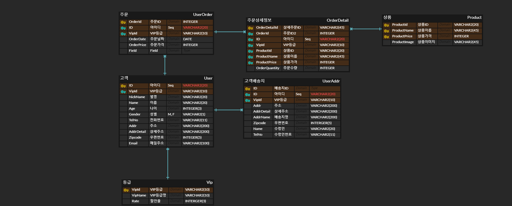

## 관계형 데이터베이스 이해 - DB 설계, ERD 작성

---

## 목차

* [관계형 데이터베이스란](#관계형-데이터베이스란)
* [특징](#특징)
* [용어](#용어)
* [예시](#예시)

## 관계형 데이터베이스란

----

* 키(key)와 값(value)들의 간단한 관계를 테이블화 시킨 매우 간단한 원칙의 전산 정보 데이터베이스
* 테이블에 데이터를 직관적이고 간단하게 표현하는 방법인 관계형 모델을 기반으로 한다.
* 테이블의 각 행(row)은 키라는 __고유 ID가 포함된 레코드__
* 테이블의 각 열(column)은 값이라는 __데이터의 속성__이 포함되어 있다.
* 데이터의 종속성을 관계로 표현하는 것이 특징


## 특징

---

* 데이터읩 분류, 정렬, 탐색속도가 빠르다
* 오랫동안 사용된 만큼 신뢰성이 높고, 어떤 상황에서도 데이터의 무결성을 보장
* 기존에 작성된 스키마를 수정하기 어렵다
* 데이터베이스의 부하를 분석하는 것이 어렵다


## 용어

---

1. 열(column)

   * 각각의 열은 유일한 이름을 가지고 있으며, 자신만의 타입을 가지고 있다
   * 이러한 열은 필드 혹은 속성이라고 불림

2. 행(row)

   * 관계된 데이터의 묶음을 의미
   * 한 테이블의 모든 행은 같은 수의 열을 가지고 있다
   * 이러한 행은 튜플 혹은 레코드라고 불림

3. 값(value)

   * 테이블은 각각의 행과 열에 대응하는 값을 가지고 있다
   * 이러한 값은 열의 타입에 맞는 값이어야 한다

4. 키(key)

   * 테이블에서 행의 식별자로 이용되는 열을 키 또는 기본 키라고 한다. 즉, 테이블에 저장된 레코드를 고유하게 식별하는 후보 키 중에서 데이터베이스 설계자가 지정한 속성을 의미

5. 관계(relationship)

   * 테이블 간 관계는 관계를 맺는 테이블의 수에 따라 다음과 같이 나뉜다.

     ```
     1. 일대일(one-to-one) 관계
     2. 일대다(one-to-many) 관계
     3. 다대다(many-to-many) 관계
     ```

   * 관계형 데이터베이스는 이러한 관계를 나타내기 위해 외래 키(foreign key)라는 것을 사용. 외래 키는 한 테이블의 키 중에서 다른 테이블의 행을 식별할 수 있는 키를 의미

6. 스키마(schema)

   * 스키마는 테이블을 디자인하기 위한 청사진
   * 스키마는 테이블의 각 열에 대한 항목과 타입뿐만 아니라 기본 키와 외래 키도 나타내야 함
   * 스키마는 개체-관계 다이어그램이나 문자열로 표현할 수 있다.


## 예시

----

아래의 쇼핑몰 ERD를 예시로 들어보자.



한 고객이 쇼핌몰에 가입을하여 제품을 구매하려고 한다.

먼저 회원가입을 하기 위해 Nicname과 이름, 나이, 성별 등을 기입하여 고객 table을 완성한다.

처음에는 vip등급을 동일하게 주고 나중에 구매 금액에 따라 할인율을 다르게 적용할 수 있도록 vip 테이블을 1:1 관계로 연결한다.

그리고 고객이 회원가입 시 입력한 주소가 아닌 다른 곳으로 주문 할 수 있는 상황을 대비해

고객배송지라는 테이블을 생성해 고객 테이블과 1:N 관계로 연결해준다.

주문 테이블의 경우, 고객이 많은 상품을 주문할 수 있기 때문에 고객 테이블과 1:N관계로 연결하고

주문상세정보 테이블과는 주문과 주문상세정보를 1:N 관계로 연결한다.

마지막으로 주문상세정보 테이블과 상품 테이블을 N:1의 관계로 연결하여 하나의 상품의 여러 주문상세정보에 들어갈 수 있게 해준다.


## 식별 관계와 비식별 관계

---

* 관계 선의 경우, 식별 관계와 비식별 관계로 나뉠 수 있다.
* __식별 관계__의 경우, ERD에서 __실선__으로 표시하고 이는 부모 테이블의 기본 키를 자식 테이블이 가지고 있고 이를 기본 키로 사용하는 경우이다.
* __비식별 관계__의 경우, ERD에서 __점선__으로 표시하고 이는 부모 테이블의 기본 키를 자식 테이블이 가지고 있지만 이를 기본 키로 사용하지 않고 참고만 하는 경우이다.
